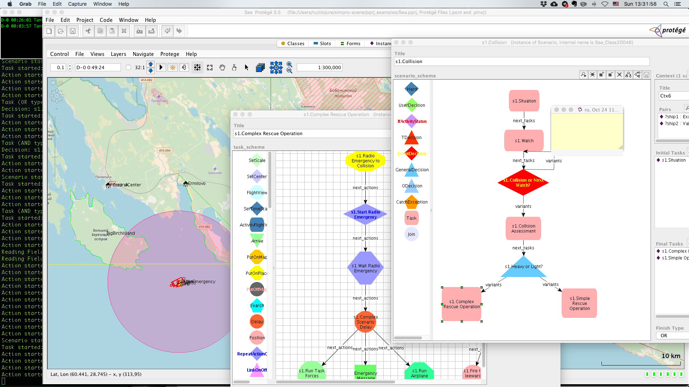

# simpro-scene

### Integrated development environment for visual creation and simulation of spatial processes.

####  Based on ontology editor [Protege-frames](https://protege.stanford.edu/), GIS library  [OpenMap](http://openmap-java.org/) and rule engine and expert system shell  [rete4frames](https://github.com/rururu/rete4frames). Uses concept of "Scenario" for describing spatial processes [1] and programming language Clojure for executive parts of rules and auxilliary scripts.

Includes general IDE for Clojure.



[1] R. P. Sorokin Visual Simulation of Spatial Processes, In V.Popovich, M.Schrenk, K.Korolenko (Eds.) Information Fusion and  Geographic Information Systems, Springer 2007, pp. 263-271.

## Start

```clj
$ cd <..>
$ git clone https://github.com/rururu/simpro-scene.git
$ cd simpro-scene
$ lein run
```
## Usage

In Protege GUI:
1. Start Protege and open plugins/ru.igis.omtb/projects/OMTest.pprj
2. Go to OpenMap Tab and play scenario (button with black triangle)
3. Run timer (by corresponding checkbox)
4. Set time scale to 64:1 (by up arrow) and enjoy spectacle of two ships collision and oil spill
5. To craft your own project you should include igis project into yours.

In Protege GUI:
1. Start Protege and open plugins/clojuretab/projects/Examples.pprj
2. Go to Instances Tab and unfold RuleEngine class
3. Select some instance of Run class and push Run button on it
4. Expert system starts and dialog with you (see screencast1 on a page https://github.com/rururu/r4f-pro)
5. To craft your own Clojure programs create a new project and include in it Clojure.pprj project
6. To craft your own Expert systems create a new project and include in it RuleEngine.pprj project

## Screencasts of examples

1. [Collision](https://youtu.be/-fDo9IdJ7RA)
2. [Get started: Simple scenario](https://youtu.be/qb8EjnkyEFQ)
3. [Get started: New project](https://youtu.be/Y693nOxbWR0)
4. [Get started: Object Mission](https://youtu.be/eT-2CQzGuEA)

TO BE CONTINUED

## License

Copyright © 2017 Ruslan Sorokin

Distributed under the Eclipse Public License either version 1.0 or (at
your option) any later version.
